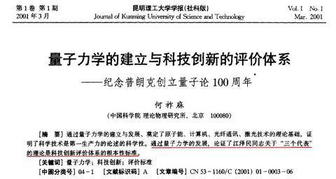
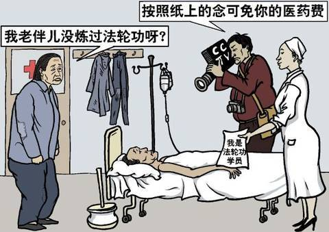

### 法轮功真像中共宣传的那样吗？

---

[<b>蓄谋已久的栽赃陷害</b>](#蓄谋已久的栽赃陷害) &nbsp;&nbsp;|&nbsp;&nbsp;[<b>所谓“围攻中南海”</b>](#四二五围攻中南海) &nbsp;&nbsp;|&nbsp;&nbsp;[<b>所谓“1400例死亡案”</b>](#1400例死亡案) &nbsp;&nbsp;|&nbsp;&nbsp; [<b>天安门自焚伪案</b>](#天安门自焚伪案)

谎言和暴力是中共的两大流氓手段。中共深谙人性，知道绝大多数人天生具有正义感，本性反对迫害好人，但对“修理”坏人乐见其成，所以中共历次要迫害谁，都先用谎言抹黑受害者，把他们诬陷为坏人，然后实施暴力。当年89年“6.4”学潮，派特务混入学生中，搞各种暴力活动，然后嫁祸学生，说学生是暴徒；19年又派特务冒充香港市民，在香港制造各种事端，说香港市民是暴徒.....   
  

 
谎言和暴力是中共的两大流氓手段

 
99年中共迫害法轮功同样如此，只是投入的宣传力量更加巨大，持续时间更加长久。中共深知，要对这么大的一个囊括中国各个阶层的、道德自律性极强的群体下黑手，除了栽赃陷害别无他法。  

#### 没有“4.25”大上访就不会迫害法轮功？  

有人说，如果你们“4.25”不去中南海上访就不会迫害你们了，其实，对法轮功的迫害，在中共内部的黑恶势力中蓄谋已久。  

96年6月《光明日报》反所谓“伪科学”；到96年7月在新闻署“扫黄打非”中全面禁止法轮功书籍发行。  

1997年初，中共政法委书记罗干指示公安部在全国进行调查，网罗罪证欲诬陷法轮功为×教。全国各地公安局经充份调查后均上报反映“尚未发现问题”，调查不了了之。1998年7月公安部一局发出公政[1998]第555号《关于对法轮功开展调查的通知》。《通知》中先把法轮功诬陷为×教，紧接着又提出：要掌握活动内幕情况，发现其违法犯罪的证据，各地公安政保部门要深入开展调查。  

罗干在1997、1998年两次想把法轮功诬为×教进行迫害。这倒不是因为法轮功做错了什么，而是罗干看到了江泽民妒忌法轮功的阴暗心理，投其所好，借此往上爬。由此可见，中共内部的恶势力一直企图寻衅迫害法轮功，即使没有挑起四•二五上访事件，也会挑起其事端来发动对法轮功的迫害。

#### 四二五围攻中南海？

1999年4月11日，罗干的亲戚何祚庥在天津教育学院办的《青少年科技博览》杂志上发表题为“我不赞成青少年练气功”的文章，这个文章的题目本身没有什么问题，有就是不认同气功，这个也是自己一家之言，无可厚非。但是，该文章却故意引用不实的事例，采用诬陷的手法，指名攻击法轮功，丑化法轮功修炼者的形象，诬蔑法轮功创始人。

 
科痞何祚庥曾用“科学”论证江泽民“三个代表”理论

 

何祚庥的文章发表后，天津的一些法轮功学员认为有必要向有关方面澄清事实真相，并期望通过与杂志编辑部的交涉来消除该文章的恶劣影响。因此，四月十八日至二十四日，一些法轮功学员前往天津教育学院及其它相关机构反映实情。到天津教育学院反映情况的法轮功学员非常和平、理性。为了保持良好的秩序，他们自觉的保持安静，不喧哗，不随意走动。他们留出通往学院各个角落的通道，校门外也有法轮功学员义务维持秩序。

 
4月18日至24日，天津数千名法轮功学员前往教育学院及其它相关机构反映实情

 

可是在1999年四月23日、24日，中共政法委书记罗干命令天津市公安局出动防暴警察三百多名，殴打反映情况的法轮功学员，导致有的法轮功学员流血受伤，四十五人被抓捕。当法轮功学员请求放人时，天津公安向法轮功学员说：“你们去北京吧，去北京才能解决问题。”

从4月24日晚开始，法轮功学员怀着对政府的信任和期待，纷纷自发前往位于中南海西侧府右街的国务院信访办上访。4月25日早上，上万名法轮功学员从各地赶去中南海信访办。起初警察在通往天安门的各个路口拦截他们，后来由警察带路，把人流导向中南海四周，最后形成了“所谓围攻中南海”。

 
1999年4月25日，法轮功学员万人上访，要求释放天津被抓的学员以及拥有合法的炼功环境

 

4月25号上午，时任国务院总理朱镕基走出中南海，随机点出3名法轮功学员向信访办反映诉求。法轮功学员提出：释放天津被捕法轮功学员；给法轮功修炼民众一个宽松的修炼环境；允许出版法轮功书籍。当天，天津学员被释放，上访学员随即和平散去。

“4.25” 开创了中国老百姓不畏强暴，打破已习惯的逆来顺受，和平理性的站出来为维护自己的权益与政府民主对话的先河，展现出了法轮功修炼者善良与坚韧精神的人格魅力。这一举措震惊世界，国际社会纷纷做出反应，说这次他们看到了中国之民主希望，看到新生的善的力量与人本性那面的光辉不可估量。

更详细还原事件经过，请查看[《话说当年“四二五”》](./425.md)

#### 1400例死亡案？

1999年7月，风云突变，中共江泽民集团为迫害法轮功制造借口，瞬间抛出了“1400例”的谎言，喉舌媒体齐上，锣鼓喧天地大肆渲染，一幅幅血淋淋的画面、一组组可怕的镜头铺天盖地而来，劈头盖脸地进入人们的视听，顿时恐怖气氛弥漫全国，使许多不明真相的民众开始敌视法轮功，自此法轮功学员们也拉开了长达十八年的澄清真相、反迫害的艰难历程。

然而，1998年国家体育总局组织北京、武汉、大连及广东省的医学专家，对近三万五千名法轮功学员做了五次医学调查，证明了法轮功祛病健身有效率高于百分之九十八。

 
1998年国家体育总局对北京法轮功学员做的医学调查

 

那么，这“1400例”到底是怎么回事呢？以下列举一些典型案例，看看中共是如何编造假新闻，栽赃诬陷法轮功的。

##### 一、中共不法官员威逼、利诱当事人，栽赃法轮功

中共迫害法轮功的政策，是作为政治任务下达到全国各级官员的。许多地方不法官员为了邀功请赏、捞取向上爬的政治资本，不择一切手段编造假新闻栽赃法轮功，公安人员逼迫犯罪分子，承诺减免刑罚；医院收买危重、绝症病人，承诺减免医药费。有些人就在这种威逼利诱下，谎称自己是炼法轮功的，配合电视台、报社记者演戏；有的人不愿违背良知说谎，便遭到毒打折磨，最后还是被迫屈从。  

 
中共为了诋毁法轮功，还利用医院收买危重、绝症病人栽赃法轮功

   

◎ “井架上吊”实为城管逼死：吉林市郊一农民以修车为生，由于没办理营业手续，修车工具被城管没收，他不堪巨大的生活压力而上吊自杀。当家属要告城管部门时，当地民政部门为政府部门开脱责任，给予抚恤，把死者说成是练法轮功的。

◎ 辽宁盘锦市“魏家杀母案”，公安部门许诺栽赃法轮功可免死罪：2000年，辽宁盘锦市电视台曾报导“魏家杀母案”。事实上，这位被杀的老年人是以拣破烂为生的，其女儿在海城游手好闲，打麻将，没钱了就找母亲要，母亲没钱给她，她在晚上将其母杀死。后来，公安部门的人给其女出主意：“你就说你炼法轮功，往法轮功上一推没死罪。”

##### 二、利用精神病患者栽赃陷害

根据中国卫生部1998年的统计数字，中国有百分之五的人（约6500万人）患有不同程度的精神病和精神障碍，其中七成是重症精神病，约40万人致残，生活不能自理。1999年中共煞费苦心搜罗了许多精神病患者病发时的意外事故，栽赃嫁祸于法轮功。

◎ 黑龙江双城市王成祥1999年跳楼内情：王成祥，男，60多岁，黑龙江省双城市韩甸镇粮库一名退休工人，家族有精神病史，他的母亲是跳井死的，舅舅是上吊死的，家族中跳井、跳河、跳房、上吊等非正常死亡的就有13人。1999年正月初二夜里，由于家人没看住，王成祥从他家六楼跳下自杀了。中央电视台就这样把他的死嫁祸于法轮功。

◎ 重庆永川双石镇龙刚跳河自杀真相：重庆永川双石镇龙刚，家住双桥街70号，精神病复发跳河死亡。龙刚死后，一个姓杜的记者采访他的妻子，把一些诬蔑法轮功的话写在纸上，叫她照着念，并给了她200元钱。

◎ 华南理工大学家属余素昭自杀案真相：余素昭在文革期间曾因精神病到广州芳村精神病院治疗几个月。1995年她隐瞒病史学起了法轮功（法轮功规定有精神病史者、家族有精神病史者不准修炼法轮功）。1998年初，余素昭精神病复发，被家人送精神病院治疗。半年后，她精神病再次发作，坠楼身亡。显然，她的死和法轮功没有丝毫关系。

##### 三、利用普通人的正常病故栽赃法轮功

生老病死是人类的自然现象，疾病是造成死亡的首要原因。据中国统计年鉴1998年所记载的全国平均死亡率，1000万人中每年约有65,000人死亡。在医学比较发达的美国，每年仅急性心肌梗塞死就有20万人。

◎ 从未炼过法轮功，却被列为“1400例”之一：王喾是机关公务员，1984年得过乙型肝炎，1998年50岁时死于肝硬化，却无故被收入“1400例”。他的妻子2001年投书明慧网说，“1998年8月，不知记者采访的谁，在报上登出来了说白发人送黑发人，栽赃陷害法轮功。我丈夫纯属正常死亡，根本不是炼法轮功炼的，他本人从未炼过法轮功。”

◎ 陈宇平之死真相：湖北省黄冈市黄州区东门学校教师陈宇平，1998年3月三次被确诊为肝癌晚期，死时34岁。1999年，当地“610”（江泽民专为迫害法轮功而成立的凌驾于法律之上的非法组织）为追随江氏集团栽赃法轮功，谎称其是炼功致死，并收入“1400例”。

更多案例分析，请查看[《1400例谎言的背后》](./1400zx.md)

#### 天安门自焚伪案

2001年1月23日，大年三十，天安门广场发生震惊世界的5人“自焚”案。中共喉舌媒体第一时间报导此案诬陷法轮功，但是漏洞百出。十几年来，此案一直被国际社会认为是中共制造的一场世纪骗局。“自焚”案发生后不久，明慧网发表了分析中共《焦点访谈》报导后得出的几大逻辑漏洞：

◎ 疑点一：头发烧不着？图片中王进东全身都烧焦了，头发基本完整，难道头发不会着火？两腿之间装汽油的雪碧瓶也一点没有在高温下变形。

   
烧不坏的头发和站着不动的警察

   

◎ 疑点二：警察在演戏还是灭火？在上图中，警察手拿灭火毯在王进东身边一动不动，不去灭火，非要等王进东喊完口号才去灭火。

◎ 疑点三：警察先到位，然后自焚者才开始点火。《焦点访谈》中有一个镜头：一个着火的人蹒跚着向前走；三个警察分别在“自焚”者的左边、右边和前面站着，手里拿着灭火器；左边的警察首先开始灭火；然后几乎同时，右边和前面的警察开始灭火；从左边第一个警察开始灭火到火被三个警察合力扑灭，整个过程大约2秒钟，这么短的时间不可能有这么多警察围在刘春玲身边灭火，只能是事先准备好的。

 
央视天安门自焚镜头的慢动作重播，证实刘春玲是被警察打死，央视焦点访谈在重播那段录像时删去了刘春玲被打死的镜头，不过真相片已经广为传播

 

◎ 疑点四：哪来的灭火器。镜头中出现了两个灭火器，还有一个背对镜头，看不见。镜头中的灭火器是类似大楼里消防用的大灭火器，长度大约相当于一个成人的手臂，而IVECO这种小型客车里配的灭火器是比较小的那种，大概只有一个成人的前臂那么长。那么警察这些大灭火器是从哪里来的？可选答案是：1. 人民大会堂或广场上其它建筑（但是事发后去取灭火器根本来不及）；2. 警察事先准备好的。

◎ 疑点五：电视台记者简直太幸运了，居然捕捉到了如此突发、短暂的焚烧镜头。整部视频中，包括了远景、中景、近景、特写，专业人士都知道，这种视频根本不可能是突发拍摄的，只能是原先安排好的拍摄。央视关于自焚的近距离特写镜头的来源受到质疑后，北京当局曾声称那些特写画面是美国CNN记者拍摄到的。但CNN国际部负责人随即否认了这种说法，指事件一开始，他们的摄影师就被逮捕了，摄影器材也被没收了。

 
准备好拍摄了才开始”自焚

 

◎ 疑点六：大面积烧伤后说话底气十足。《焦点访谈》中放了几个医生描述烧伤状况，说气管烧伤，需要切开喉管做手术。众所周知，人身上着火，身体周围的气体温度非常高。这时人呼吸吸入灼热气体，必然会烧伤舌头、声带、气管。 然而，身受如此重伤的陈果和刘思影却仍然能在新华社的报导里与记者对白，刘思影还能中气十足的唱歌！

 
气管被切开的刘思影还能中气十足的唱歌

 

◎ 疑点七：发稿速度异常、内容前后不一。新华社历来对敏感新闻发稿都需要经过一稿、二稿，甚至五稿六稿，但对天安门自焚事件，却在事件发生仅两个小时后便对外发了英文稿，速度之快，令人生疑，似乎稿件已提前写好。一个星期后《人民日报》做出了更为详细的报导，而这时报导中自焚的人数从原来的五人增加到七人，其中一个是年仅十二岁的刘思影。

@ 疑点八：台湾国立大学语言实验室进行的第三方语音比较鉴定表明，出现于中央电视台“焦点访谈”第一集和第二、第三集中的“王进东”不是同一个人。

@ 疑点九：《华盛顿邮报》在2001年2月4日头版头条发表了调查报告《自焚的火焰照亮了中国的黑幕》。邮报记者菲力蒲‧潘亲自到刘春玲的家乡开封实地调查发现，邻居们说从来没有人看见过刘春玲炼法轮功。

--

2002年1月，北美中文电视台“新唐人”制作了揭露2001年“天安门自焚真相”的纪录片《伪火》（False Fire），该片从各国参赛的六百多部影片中脱颖而出，于2003年11月8日荣获第51届哥伦布国际电影电视节荣誉奖。
更详细的分析，请查看[《世纪骗局 - 天安门自焚伪案揭秘》](./falsefire.md)

---

[<b>首页</b>](../README.md) &nbsp;&nbsp;|&nbsp;&nbsp; [<b>手机上长按此链接分享</b>](#) 

